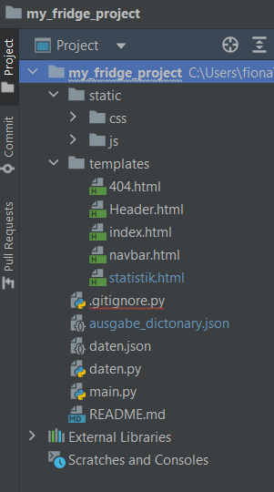

# Über mein Projekt
***My Fridge*** 
 
Das Projekt My Fridge ermöglicht es den User, ihre Lebensmittel welche im Kühlschrank sind, besser im Auge zu behalten. Vor allem bezogen auf das Mindesthaltbarkeitsdatum, kurz MHD bezogen. Mit My Fridge werden folgende Angaben zu den Lebensmitteln abgefragt:  
- Name
- Kategorie
- MHD
- Bewertung

Nebst dem Namen und MHD sieht der Nutzer so bei der Ausgabe auch gleich wieder, wie gut ihm das Produkt gefallen hat und zu welcher Kategorie es gehört.  Durch die Datenverarbeitung wird schlussendlich unter Auswertung my Fridge die Lebensmittel angezeigt, welche abgelaufen sind. Und man erhält eine Übersicht, welche nach Haltbarkeit sortiert ist.
 
# Workflow
Die Daten werden im Formular eingegeben und in einer json Datei gespeichert. Schlussendlich werden berechnete Daten und sortierte Daten auf der Seite Statistik angezeigt.
# Installation
Das Projekt My Fridge kann heruntergeladen werden und auf dem eigenen Gerät installiert werden. Die Daten werden dann auf dem eigenen Gerät gespeichert.
# Benutzung
Die Webapplikation kann standardmässig ausgeführt werden.Um denfrisch zu behalten, kann der Benutzer die Datensätze direkt in der Datei:ausgabe_dictonary.json löschen,wenn etwas nicht mehr im Kühlschrank ist.
# Ablaufdiagramm

# Ordnerstruktur:
Für allfällige Erweiterungen oder Skalierungen des Projektes sind in der Ordner Struktur alle Bootstrap Datein abgelegt. Die Ordnerstruktur sieht wiefolt aus:

# Mögliche Erweiterung
Die Autorin versuche sich mit der visuellen Darstellung der Lieblingsprodukte. Leider funktionierte dies nicht, da es eine Fehlermeldung (welche nicht behoben werden konnte) bei der Installation von Plotly gab. In einer Erweiterung müsste diese Fehlermeldung angegangen werden oder eine andere Bibliothek als Plotly verwendet werden müssen. Auf jeden Fall könnte so die aktuellen Produkte auf einer x-Achse und die jeweilige Bewertung auf der y-Achse angezeigt werden. Nebst der Visualisierung können weitere Statistiken erstellt werden, wie zum Beispiel welche Kategorie hat durchschnittlich der beste Wert der Beurteilung.
# Gebaut mit
- Python
- HTML
- FLask
- Bootstrap (CSS)